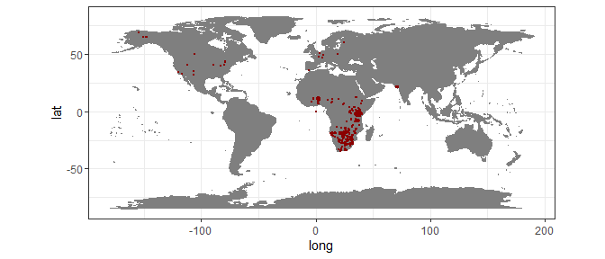
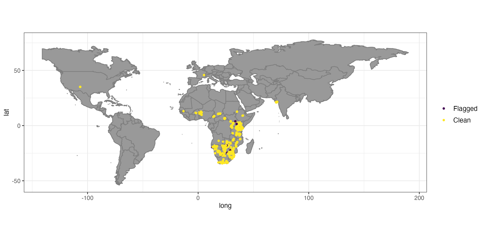
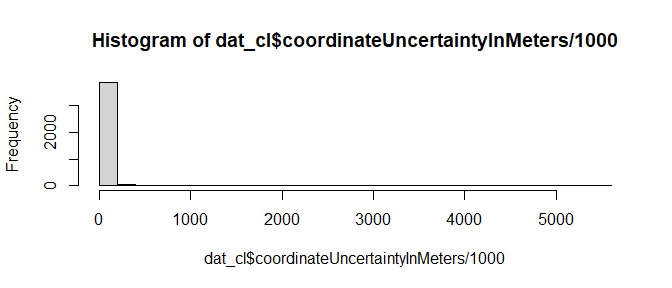
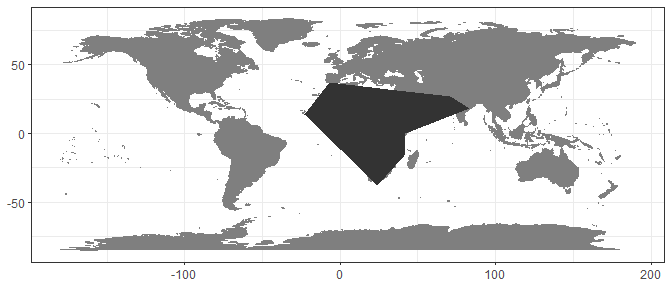
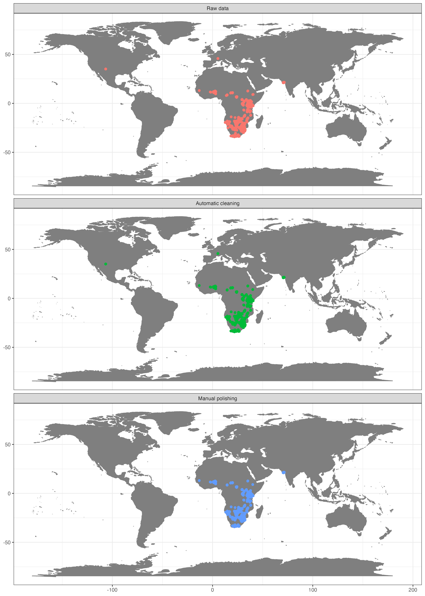
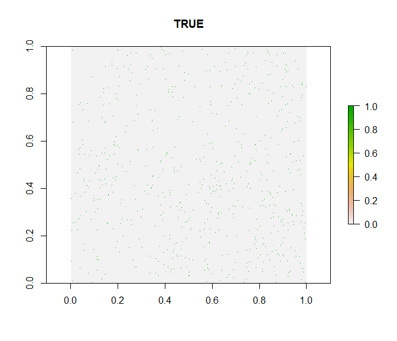

```{r options, echo = FALSE}
knitr::opts_chunk$set(eval = FALSE)
```

# Background
Big data aggregators such as the Global Biodiversity Information Facility (GBIF,
www.gbif.org) have vastly increased the public availability of species
occurrence records, with GBIF alone comprising more than 800 million records
across all taxonomic groups. The data provided via these sources have
revolutionized scientific biogeography and are highly valuable for research.
However, some issues exist concerning data quality, mostly because these data
are comprised from a variety of different collection methods (museum specimens,
scientific surveys, citizen science, population counts for conservation purposes
and genetic barcoding among others) and different sources (museums, herbaria,
collections of individual researchers, citizen science, photo apps) and
digitized and edited by various people and algorithms at different points in
time and space.

In this tutorial we provide a pipeline on how to clean occurrence records
retrieved from GBIF (or any other database) using *CoordinateCleaner* and meta
data. The tutorial includes major steps we consider necessary, but by no means
is complete and we explicitly encourage you to explore your data further before
use. For the tutorial we will use a data set of occurrence records of a single
species (lion, *Panthera leo*) downloaded from GBIF. On this example we can
gauge the quality of cleaning steps, because we already have a good idea where
we expect lions to occur. Of course, usually for multi-species data sets we do
not have this kind of information, and that is the whole point of the automated
cleaning. You can easily follow the tutorial using your own data instead. For
the tutorial we will assume a global macroecological analysis with a resolution
of about 100km as downstream analyses. Remember to adjust test sensitivity, if
your analyses have a coarser or finer resolution.

With this tutorial you will be able to:

1. Visualize the data and identify potential problems 2. Use
*CoordinateCleaner* to automatically flag problematic records 3. Use GBIF
provided meta-data to improve coordinate quality, tailored to your downstream
analyses 4. Use automated cleaning algorithms of *CoordinateCleaner* to identify
problematic contributing datasets

# Identifying erroneous coordinates with *CoordinateCleaner*

The `clean_coordinates` function is a wrapper function around all record-level tests of *CoordinateCleaner*. The idea behind these tests is to use geographic gazetteers to identify records that are most likely erroneous (or very imprecise). We based the choice of tests on common problems observed in biological collection databases [@Maldonado2015], including assignment to country centroids, sea coordinate and outliers among others. You can get an overview over the individual tests using `?clean_coordinates` or via the [package vignettes](https://ropensci.github.io/CoordinateCleaner/). This tutorial assumes occurrence data in the format as downloaded from GBIF, for other formats you might need to adapt the column names. You might need to install some of the required packages for the tutorial using `install.packages`.

## Install `CoordinateCleaner`
You can install the latest stable version of CoordinateCleaner from CRAN using `install.packages("CoordinateCleaner")`. Alternatively you can install the latest development version from GitHub using the devtools package. We recommend the latter, to stay up-to-date. Also, make sure to have the latest R version installed.

```{r intall_github, eval=FALSE}
install.packages("devtools")
library(devtools)
install_github("ropensci/CoordinateCleaner")
```


## Set up libraries and data
You might need to confirm to install the rnaturalearth package when loading `CoordinateCleaner`

```{r libraries}
library(countrycode)
library(CoordinateCleaner)
library(dplyr)
library(ggplot2)
library(rgbif)
library(sf)
```


```{r obtain data}
#obtain data from GBIF via rgbif
dat <- occ_search(scientificName = "Panthera leo", 
                  limit = 5000, 
                  hasCoordinate = TRUE)

dat <- dat$data

# names(dat) # a lot of columns

# select columns of interest
dat <- dat %>%
  dplyr::select(species, decimalLongitude, 
                decimalLatitude, countryCode, individualCount,
                gbifID, family, taxonRank, coordinateUncertaintyInMeters,
                year, basisOfRecord, institutionCode, datasetName)

# remove records without coordinates
dat <- dat %>%
  filter(!is.na(decimalLongitude)) %>%
  filter(!is.na(decimalLatitude))
```

## Visualize the data on a map

```{r map1}
#plot data to get an overview
wm <- borders("world", colour = "gray50", fill = "gray50")
ggplot() +
  coord_fixed() +
  wm +
  geom_point(data = dat,
             aes(x = decimalLongitude, y = decimalLatitude),
             colour = "darkred",
             size = 0.5) +
  theme_bw()
```


```{r, echo=FALSE, eval = TRUE, out.width="100%", fig.cap="Occurrence records for Panthera leo obtained from GBIF."}

```


This map clearly indicates, that we need to prepare the data further, if we want
them to represent the current day (or historic) distribution of lions.

## Use *CoordinateCleaner* to automatically flag problematic records

### Option A) Using the `clean_coordinates` wrapper function
As a first step we will run the automatic cleaning algorithm of
CoordinateCleaner. The `clean_coordinates` function is a wrapper around a large
set of automated cleaning steps to flag errors that are common to biological
collections, including: sea coordinates, zero coordinates, coordinate - country
mismatches, coordinates assigned to country and province centroids, coordinates
within city areas, outlier coordinates and coordinates assigned to biodiversity
institutions. You can switch on each test individually using logical flags,
modify the sensitivity of most individual tests using the ".rad" arguments, and
provide custom gazetteers using the ".ref" arguments. See `?clean_coordinates`
for help. To use the country - coordinate mismatch test we need to convert the
country from ISO2 to ISO3 format.


```{r}
#convert country code from ISO2c to ISO3c
dat$countryCode <-  countrycode(dat$countryCode, 
                                origin =  'iso2c',
                                destination = 'iso3c')

#flag problems
dat <- data.frame(dat)
flags <- clean_coordinates(x = dat, 
                           lon = "decimalLongitude", 
                           lat = "decimalLatitude",
                           countries = "countryCode",
                           species = "species",
                           tests = c("capitals", "centroids",
                                    "equal", "zeros", "countries")) # most test are on by default
```

```R
## Testing coordinate validity
## Flagged 0 records.
## Testing equal lat/lon
## Flagged 0 records.
## Testing zero coordinates
## Flagged 0 records.
## Testing country capitals
## Flagged 36 records.
## Testing country centroids
## Flagged 1 records.
## Testing country identity
## Flagged 314 records.
## Flagged 350 of 5000 records, EQ = 0.07.
```

```{r}
summary(flags)
plot(flags, lon = "decimalLongitude", lat = "decimalLatitude")
```


{width=100%}

```R
##    .val     .equ     .zer     .cap     .cen     .con .summary 
##       0        0        0       36        1      314      350 

```

The automatic test flagged 7% of the records. For the purpose of this tutorial
we will exclude the flagged records, but in general it is recommendable to
explore them further.


```{r}
#Exclude problematic records
dat_cl <- dat[flags$.summary,]

#The flagged records
dat_fl <- dat[!flags$.summary,]
```

### Option B) Using the magrittr pipe (%>%)
Alternatively, you can run all tests implemented in *CoordinateCleaner* with a
individual function and connect them using the magrittr pipe operator, which
will directly result in a `data.frame` comprising only cleaned records.


```{r}
# To avoid specifying it in each function
names(dat)[2:3] <- c("decimalLongitude", "decimalLatitude")

clean <- dat %>%
  cc_val() %>%
  cc_equ() %>%
  cc_cap() %>%
  cc_cen() %>%
  cc_coun(iso3 = "countryCode") %>%
  cc_sea() %>%
  cc_zero() %>%
  cc_outl() %>%
  cc_dupl()
```

In this way, you can also add the individual test results as columns to your initial data.frame:


```{r}
dat %>%
    as_tibble() %>% 
    mutate(val = cc_val(., value = "flagged"),
           sea = cc_sea(., value = "flagged"))
```

### Temporal outliers
While the `cc_outl` function identifies geographic outliers, record in GBIF migh also have doubtful temporal information, i.e. for the time of collection, which can be problematic for example for analyses of range dynamics. The `cf_age` function used for fossil cleaning can also be used to check GBIF records for temporal outliers.


```{r}
flags <- cf_age(x = dat_cl,
                lon = "decimalLongitude",
                lat = "decimalLatitude",
                taxon = "species", 
                min_age = "year", 
                max_age = "year", 
                value = "flagged")
# Testing temporal outliers on taxon level
# Flagged 0 records.

dat_cl <- dat_cl[flags, ]
```

# Improving data quality using GBIF meta-data
That helped a lot, but unfortunately some unwanted records remain, especially within Europe (Fig. \ref{fig:automated}). This is mostly because we have used the occurrence records uncritically and ignored the meta-data. GBIF offers a whole lot of useful meta-data which we will use now to further refine quality of our dataset. First we'll remove coordinates with very low precision and from unsuitable data sources. We will remove all records with a precision below 100 km as this represent the grain size of our downstream analysis, but we recommend you to chose it based on your downstream analyses. We also exclude fossils as we are interested in recent distributions; and records from unknown sources, as we deem them not reliable enough.


```{r}
#Remove records with low coordinate precision
dat_cl %>% 
  mutate(Uncertainty = coordinateUncertaintyInMeters / 1000) %>% 
  ggplot(aes(x = Uncertainty)) + 
  geom_histogram() +
  xlab("Coordinate uncertainty in meters") +
  theme_bw()

```

{width=100%}

```{r}
dat_cl <- dat_cl %>%
  filter(coordinateUncertaintyInMeters / 1000 <= 100 | is.na(coordinateUncertaintyInMeters))

# Remove unsuitable data sources, especially fossils 
# which are responsible for the majority of problems in this case
table(dat$basisOfRecord)

## HUMAN_OBSERVATION    MATERIAL_SAMPLE PRESERVED_SPECIMEN 
##              4979                  2                 19 

dat_cl <- filter(dat_cl, basisOfRecord == "HUMAN_OBSERVATION" | 
                         basisOfRecord == "OBSERVATION" |
                         basisOfRecord == "PRESERVED_SPECIMEN")
```

In the next step we will remove records with suspicious individual counts. GBIF includes few records of absence (individual count = 0) and suspiciously high occurrence counts, which might indicate inappropriate data or data entry problems. 

```{r}
#Individual count
table(dat_cl$individualCount)
```

```
## 
##    1
##    84 
```

```{r}
dat_cl <- dat_cl %>%
  filter(individualCount > 0 | is.na(individualCount)) %>%
  filter(individualCount < 99 | is.na(individualCount)) # high counts are not a problem
```

We might also want to exclude very old records, as they are more likely to be
unreliable. For instance, records from before the second world war are often
very imprecise, especially if they were geo-referenced based on political
entities. Additionally old records might be likely from areas where species went
extinct (for example due to land-use change). Although this is not a problem in
our dataset, we could still remove it with the following code.


```{r}
#Age of records
table(dat_cl$year)
```

```
## 2015 2016 2017 2018 2019 2020 2021 2022 2023 
## 308  351  612  547  750  323  408  736  470 
```

```{r}
dat_cl <- dat_cl %>%
  filter(year > 1945) # remove records from before second world war
```

On top of the geographic cleaning, we also want to make sure to only include
species level records and records from the right taxon. The latter is not a
problem in this case, as we only have one species, but it can be helpful for
large datasets. Taxonomic problems such as spelling mistakes in the names or
synonyms can be a severe problem. We'll not treat taxonomic cleaning here, but
if you need to, check out the [taxize R
package](https://docs.ropensci.org/taxize/) or the [taxonomic name resolution
service](https://tnrs.biendata.org) (plants only).


```{r}
table(dat_cl$family) #that looks good
## 
## Felidae 
##    4505
dat_cl <- dat_cl %>%
  filter(family == 'Felidae')

table(dat_cl$taxonRank) # this is also good
## 
##   SPECIES SUBSPECIES 
##       520       3985 
```


We excluded almost 10% of the initial data points with the data cleaning, and
the general picture has improved considerably. We confined the records mostly to
what can be considered current day distribution of the species of interest (Fig.
\ref{fig:final}).
We have, however, also lost quite a number of records. In general, there is no
"one-size-fits-it-all" for data quality of geographic species occurrence
records. Of course highest coordinate precision is desirable, but what is
acceptable will strongly depend on the downstream analyses. For species
distribution modelling, usually high precision is necessary e.g. 1-10 km, but
for other analyses such as biogeographic reconstructions using tectonic plates,
a record might be considered good enough quality, as long as it is on the right
continent. As another example for conservation purposes it might be sufficient
to know that a species is present within a certain country.

# Improving data quality using external information 
Figure \ref{fig:final} shows the success of automated cleaning. However, records
within Europe and North America remain. A short inspection of the data suggests
that these are a dubious human observation and five specimens, potentially
assigned to their specimen location, or fossils with misclassified meta-data.
One option to automatically flag these records is to rerun the outlier test on
the cleaned data. However, this would most likely also flag the isolated Indian
population (which is a true presence) as problematic.

## Flag records based on fixed longitude and latitude 
The first option alternative is to exclude records outside a certain study
extent. In our example this is the easiest solution because we know that lions
do not occur in high latitudes any more.


```{r}
#exclude based on study area
dat_fin <- filter(dat_cl, decimalLatitude < 40)
```

## Flag records based on species natural ranges
In cases where simple latitudinal or longitudinal borders are not useful, an
alternative is to use species ranges from external source as reference and flag
all records falling outside these ranges. For amphibians, birds, mammals and
reptiles the International Union for the conservation of nature (IUCN) provides
detailed shape files of species' natural distribution ranges. These can be
downloaded for free at
https://www.iucnredlist.org/resources/spatial-data-download. *CoordinateCleaner*
implements a straight forward way to use these, or any other, ranges to flag
records in the `cc_iucn` function. Since downloading the IUCN shapes requires
log-in we will approximate lion's natural range from scratch for our example.
For plants check out the botanical countries of the [World Checklist of selected
plant families](https://powo.science.kew.org/).


```{r}
#create simple natural range for lions
coords_range <- cbind(cbind(c(-23, -7, 31, 71, 83, 42, 41, 24, -23), c(14, 37, 32, 27, 18, 0, -16, -38, 14)))
wgs84 <- "+proj=longlat +datum=WGS84 +no_defs +ellps=WGS84 +towgs84=0,0,0"

nat_range <- terra::vect(coords_range, "polygons",
                     crs = wgs84)
nat_range$species <- "Panthera leo"
 
# Visualize range
plo <- sf::st_as_sf(nat_range)

## Regions defined for each Polygons
ggplot() +
  borders("world", colour = "gray50", fill = "gray50") +
  geom_sf(data = plo, aes(fill = species), alpha = 0.5) +
  theme_bw() +
  theme(legend.position = "none",
        axis.title = element_blank())
```

{width=100%}

```{r}

# run cc_iucn()
range_flags <- cc_iucn(x = dat_cl,
                       range = nat_range,
                       lon = "decimalLongitude",
                       lat = "decimalLatitude",
                       value = "flagged")
```

```r
## Testing natural ranges
## Flagged 141 records.
## Warning message:
## In cc_iucn(x = dat_cl, range = nat_range, lon = "decimalLongitude",  :
##   reprojecting reference to '+proj=longlat +datum=WGS84 +no_defs'
```

```{r}
dat_fin <- dat_cl[range_flags, ]
```


```{r, echo = FALSE}
dat <- dat %>% 
  as_tibble() %>% 
  mutate(phase = "Raw data")
dat_cl <- dat_cl %>% 
  mutate(phase = "Automatic cleaning")
dat_fin <- dat_fin %>% 
  mutate(phase = "Manual polishing")

dat %>% 
  bind_rows(dat_cl, dat_fin) %>% 
  mutate(phase = factor(phase, c("Raw data", "Automatic cleaning", "Manual polishing"))) %>% 
  ggplot(aes(x = decimalLongitude, y = decimalLatitude, color = phase)) +
  borders("world", colour = "gray50", fill = "gray50") +
  geom_point() +
  theme_bw() +
  theme(legend.position = "none",
        axis.title = element_blank()) +
  facet_wrap(. ~ phase, ncol = 1)

```


```{r, echo=FALSE, eval = TRUE, out.width="100%", fig.cap="\\label{fig:final}The dataset of occurrence of lions after different cleaning phases."}

```


# Identifying problematic data sets
Some types of potentially problematic coordinates can cause bias, but are not identifiable on record-level if the relevant meta-data are missing. This is especially the case if the erroneous records have been combined with precise GPS-based point occurrences into datasets of mixed precision. Two important cases are: (A) coordinate conversion errors based on the misinterpretation of the degree sign as decimal delimiter and (B) data derived from rasterized data collection designs (e.g. presence in a 50x50 km grid cell). *CoordinateCleaner* implements two algorithms to identify these problems on a dataset level.

## Identify dataset with ddmm to dd.dd conversion error
We will first run the test for erroneous data conversion due to the misinterpretation of the degree sign as decimal delimiter. We will use the `cd_ddmm` function, alternatively, you can use the `clean_dataset` wrapper. See supplementary material S1 for a detailed description of the algorithm and implementation of the test. You can control the output of the function via the `value` argument.


```{r}
out.ddmm <- cd_ddmm(dat_cl, lon = "decimalLongitude", lat = "decimalLatitude", 
                    ds = "species", diagnostic = T, diff = 1,
                    value = "dataset")
```



This looks good. The test indicates a slightly higher fraction of records with decimals below .60 than expected at random, but this is within the expected range and thus the test indicates no bias, which is confirmed by the diagnostic plot. In the case of a strong bias, the green points would be clustered in the bottom left quarter of the plot.

## Test for rasterized sampling
As a second step we will use the `cd_round` function to identify datasets with a significant proportion of coordinates that have been collected in large scale lattice designs. These records might have a low precision and might therefore be problematic for some analyses. For instance presence derived from a 1 degree grid of a national atlas might be to coarse for small scale species distribution models. 


```{r}
par(mfrow = c(2,2), mar = rep(2, 4))
out.round <- cd_round(dat_fin, lon = "decimalLongitude", 
                      lat = "decimalLatitude", 
                      ds = "species",
                      value = "dataset",
                      T1 = 7,
                      graphs = T)
## Testing for rasterized collection
```


These results look good. The dataset does not show rasterized collection schemes (see Supplementary material S1 for examples of biased datasets). The test has detected and flagged some small scale and low intensity periodicity in the longitude coordinates, however, the entire dataset is only flagged if both longitude and latitude show a pattern (as expected from rasterized sampling). You can modify the test sensitivity using various arguments. See `?cd_round` for more information.

The lion dataset is relatively small and consistent, at least in the way that it only comprises on species. For larger scale analyses you might need to deal with larger datasets, composed from a larger variety of sources.

## References
