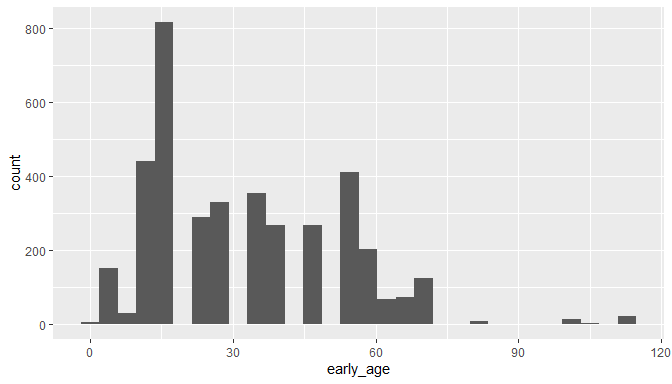

```{r options, echo = FALSE}
knitr::opts_chunk$set(eval = FALSE)
```


# Background
The public availability of fossils for large-scale analyses is rapidly increasing, mainly due to increased databasing efforts and data aggregators such as the paleobiology database (www.paleobiodb.org) or Neotoma (www.neotomadb.org), among others. However, data quality is an issue, in particular, for old collections or collections with uncertain taxonomy and/or bad preservation. Similar problems as known from biological collection databases (See supplementary material S2) are relevant for fossils, but in addition fossils might be dated wrongly or with very low precision. This tutorial presents a pipeline to clean fossil data from the paleobiology database (or any other) before using it in biogeographic or evolutionary analyses. We focus on identifying overly imprecisely geo-referenced and/or dated records by combining automated cleaning using *CoordinateCleaner* with cleaning based on meta-data. The proposed steps are by no means exhaustive, and keep in mind that what is "good data" depends entirely on your downstream analyses! We wrote this tutorial (and the whole *CoordinateCleaner* package) to help you to identify potential problems quicker and more reproducibly to improve data quality in large datasets. For the sake of this tutorial we will mostly remove flagged records from the dataset, however, we recommend to double check them individually.

# Install `CoordinateCleaner`
You can install the latest stable version of CoordinateCleaner (Currently 2.0-1) from CRAN using `install.packages("CoordinateCleaner")`. Alternatively you can install the latest development version from GitHub using the devtools package. We recommend the latter, to stay up-to-date. Also, make sure to have the latest R version installed. In this tutorial, relevant R-code is shown in grey boxes, the resulting output lines are marked by ##. 


```{r} 
install.packages("devtools")
library(devtools)

install_github("ropensci/CoordinateCleaner")
```

# Load required libraries
As a first step we will load the R libraries required for the tutorial. You might need to install some of them using `install.packages`. 


```{r} 
library(dplyr)
library(ggplot2)
library(CoordinateCleaner)
library(countrycode)
library(paleobioDB)
```

# Load test dataset
For this tutorial we will use a dataset of vascular plant fossils from the last 65 million years, downloaded from the paleobiology database using the plaeobioDB package. For the tutorial we'll limit the data to maximum 5,000 records, to keep the downloading time reasonable. If you obtained your data from the web mask of the paleobiology database, or use an entirely different database, you will have to adapt the column names in the script.


```{r} 
#load data
dat <- paleobioDB::pbdb_occurrences(base_name = "Magnoliopsida", 
                                    vocab = "pbdb", limit = 5000,
                        show = c("coords", "phylo", "attr", "loc", "time", "rem"))
dat <- dat %>% mutate(lng = as.numeric(lng), 
               lat = as.numeric(lat), 
               early_age = as.numeric(early_age),
               late_age = as.numeric(late_age))
rownames(dat) <- NULL
```

Alternatively, CoordinateCleaner includes an example dataset, downloaded from paleobioDB as specified above. We will use this one for the rest of this tutorial.


# Visualize the records on a map
As a first step we will visualize the records on a map, to get a general overview.


```{r} 
#plot data to get an overview
wm <- borders("world", colour = "gray50", fill = "gray50")
dat %>% 
  ggplot(aes(x = lng, y = lat)) +
  coord_fixed() +
  wm +
  geom_point(
             colour = "darkred",
             size = 0.5) +
  theme_bw()
```


# CoordinateCleaner
 CoordinateCleaner includes a suite of automated tests to identify problems common to biological and palaebiological databases.

## Spatial issues
We'll first check coordinate validity to check if all coordinates are numeric and part of a lat/lon coordinate reference system using `cc_val`.


```{r} 
cl <- cc_val(dat, lat = "lat", lon = "lng")
```

```
## Testing coordinate validity
```

```
## Removed 0 records.
```

Looks good, then we will test for coordinates with equal longitude and latitude. You can use the `test` argument to specify if coordinates should be flagged if their absolute values are identical (e.g. 56,-56).


```{r} 
cl <- cc_equ(cl, lat = "lat", lon = "lng")
```

```
## Testing equal lat/lon
```

```
## Removed 0 records.
```

For the purpose of the tutorial, we will always exclude flagged records. If you want to further explore them, and you should if by any means possible, use the `value = "flagged"` argument, valid for all functions. In that case the output value will be a vector of logical values with the same length as `dat`, where TRUE = valid record, FALSE = flagged record. It is generally advisable to check flagged records whenever possible, to avoid data-loss and false flags.


```{r} 
fl <- cc_equ(dat, value = "flagged", lat = "lat", lon = "lng")
## Testing equal lat/lon
## Flagged 0 records.

# extract and check the flagged records
fl_rec <- dat[!fl,] 
head(fl_rec)
##  [1] occurrence_no  record_type    collection_no  taxon_name     taxon_rank     taxon_no       matched_name   matched_rank  
##  [9] matched_no     early_interval late_interval  early_age      late_age       reference_no   lng            lat           
## [17] class          class_no       phylum         phylum_no      cc             state          geogscale      early_age.1   
## [25] late_age.1     cx_int_no      early_int_no   late_int_no    genus          genus_no       family         family_no     
## [33] order          order_no       county         reid_no       
## <0 rows> (or 0-length row.names)
```

We'll also test if the records are identical, or in close vicinity to the centroids of political units. You can modify the buffer around each centroid using the `buffer` argument and the level of testing (country centroids, province centroids, or both) using the `test argument`. In case you have a list of geographic coordinates you consider problematic, for instance a list of cities you can provide them as custom gazetteer using the `ref` argument.


```{r} 
fl <- cc_cen(cl, lat = "lat", lon = "lng", value = "flagged")
## Testing country centroids
## Flagged 6 records.
fl_rec <- cl[!fl, ]
unique(fl_rec$cc)
## [1] JP
## Levels: NZ US CN IR KP AU UK FR JP DE CA RU KE ZM EG CD ZA TZ UG ET MX IT
cl <- cl[fl, ]
```

Next we will test if the coordinates are within the country they are assigned to. This test is a bit more tricky, as it will also flag records, if the country name in the country column is not following ISO3 or if the records have been assigned during a different political landscape. For instance records from former Western and Eastern Germany. Here we need to convert the country annotation in column cc from ISO2 to ISO3; it is advisable to double check which records have be flagged, to avoid unnecessary data loss (see above).


```{r} 
#adapt country code to ISO3, for country test
cs_ma <- "GBR"
names(cs_ma) <- "UK"
cl$cc_iso3 <- countrycode(cl$cc, origin = "iso2c", destination = "iso3c", custom_match = cs_ma)

cl <- cc_coun(cl, lat = "lat", lon = "lng", iso3 = "cc_iso3")
## Testing country identity
## Removed 234 records.
```

Next we will test if any of the records bear the coordinates of a hosting biodiversity institution or the GBIF headquarters, using the `institutions` database of *CoordinateCleaner*. As for the country centroid test you can change the buffer around the institutions with the `buffer` argument.


```{r} 
cl <- cc_inst(cl, lat = "lat", lon = "lng")
## Testing biodiversity institutions
## Removed 0 records.
cl <- cc_gbif(cl, lat = "lat", lon = "lng")
## Testing GBIF headquarters, flagging records around Copenhagen
## Removed 0 records.
```

Finally, we will test for plain zero coordinates (e.g. 0/0).


```{r} 
cl <- cc_zero(cl, lat = "lat", lon = "lng")
## Testing zero coordinates
## Removed 0 records.
```

## Temporal issues
The spatial cleaning above is mostly identical with steps from recent geographic records. Additionally \emph{CoordinateCleaner} includes three functions to test the temporal dimension of fossils. Fossil ages are usually defined with a maximum and a minimum range, based on geological strata. First we will exclude records without dating information (NA) and then test for records with equal minimum and maximum range. Unless your data includes absolutely dated fossils, this will most likely be an data entry error.


```{r} 
cl <- cl[!is.na(cl$late_age),]
cl <- cl[!is.na(cl$early_age),]
cl <- cf_equal(cl, min_age = "late_age", max_age = "early_age")
## Testing age validity
## Removed 0 records.
```

Next we will look at the age range (= max age - min age) of each record. The age range is the dating precision and can vary considerably, depending on the data available for dating. For many analyses, for instance in PyRate, very imprecisely dated records are not suitable. Lets first have a look at the age ranges in our test dataset.


```{r} 
rang <- cl$early_age - cl$late_age
hist(rang, breaks = 40, xlab = "Date range [max age - min age]", main = "")
```


Some individual records are dated with a precision of more than 60 million years! \emph{CoordinateCleaner} offers two ways to flag records based on their age range (1) based on absolute age, e.g. age range > 35 million years or (2) based on age range outlier detection in the entire dataset (e.g. if few records are much less precisely dated than the rest of all records) and (3) based on age range outlier detection on taxon level (e.g. all \emph{Quercus} records that are much less precisely dated than the other \emph{Quercus} records. The second and third approach can be combined and offer some more flexibility over the absolute age limit, but need some consideration on the desired sensitivity. Here, we will run all three variants for illustration, if you use your own data you should decide which one is more suitable depending on your downstream analyses. In the case of (2) and (3) you can tweak the test sensitivity using the `mltpl` argument.


```{r} 
# Outlier dataset
cl <- cf_range(cl, taxon = "", min_age = "late_age", max_age = "early_age")
## Testing temporal range outliers on dataset level
## Removed 57 records.

# Outlier per taxon
cl <- cf_range(cl, taxon = "taxon_name", min_age = "late_age", max_age = "early_age")
## Testing temporal range outliers on taxon level
## Removed 86 records.

# Absolute age limit
cl <- cf_range(cl, taxon = "taxon_name", min_age = "late_age", 
               max_age = "early_age", method = "time", max_range = 35)
## Testing temporal range outliers on taxon level
## Removed 1 records.

rang <- cl$early_age - cl$late_age
hist(rang, breaks = 40, xlab = "Date range [max age - min age]", main = "")
```


Finally we will test for outliers in space-time, that is records that are either very distant in space or in time from all other records (1) in the dataset (2) per taxon. The test is again based on quantile outlier detection and can be modified using  various arguments. Here it is important to carefully consider the desired test sensitivity. See `?cf_outl` for help.


```{r} 
# Outlier dataset
cl <- cf_outl(cl, taxon = "", lat = "lat", lon = "lng",
              min_age = "late_age", max_age = "early_age")
## Testing spatio-temporal outliers on dataset level
## Removed 256 records.

# Outlier taxon
cl <- cf_outl(cl, taxon = "taxon_name", lat = "lat", lon = "lng",
              min_age = "late_age", max_age = "early_age")
## Testing spatio-temporal outliers on taxon level
## Removed 30 records.
```

Done! To check how many records have been flagged in total, you can compare the two datasets.


```{r} 
nrow(dat) - nrow(cl)
```

```
## [1] 689
```


All test combined have removed about 689 records (13.8%). If you want to identify all flagged records, to double check or correct them, take a look at the `clean_fossils` wrapper function below. 

So far so good, we have significantly refined the data  for our needs. In section 6 we will have a look at the meta-data for further refinement, but before, note that there are two different ways to run *CoordinateCleaner*. You can  connect all functions directly in a row using the magrittr pipe (%>%) operator.


```{r} 
#adapt country code to ISO3, for country test
cs_ma <- "GBR"
names(cs_ma) <- "UK"
dat$cc <- countrycode(dat$cc, origin = "iso2c", destination = "iso3c", custom_match = cs_ma)

cl <- dat %>%
  cc_val(lat = "lat", lon = "lng") %>%
  cc_equ(lat = "lat", lon = "lng") %>%
  cc_cen(lat = "lat", lon = "lng") %>%
  cc_coun(lat = "lat", lon = "lng", iso3 = "cc") %>%
  cc_gbif(lat = "lat", lon = "lng") %>%
  cc_inst(lat = "lat", lon = "lng") %>%
  cc_zero(lat = "lat", lon = "lng") %>%
  cf_equal(min_age = "late_age", max_age = "early_age") %>%
  cf_range(
    taxon = "taxon_name",
    lat = "lat",
    lon = "lng",
    min_age = "late_age",
    max_age = "early_age"
  ) %>%
  cf_outl(
    taxon = "taxon_name",
    lat = "lat",
    lon = "lng",
    min_age = "late_age",
    max_age = "early_age"
  )
```

Alternatively you can use `clean_fossils`, a wrapper around all quality tests provided by *CoordinateCleaner* relevant for fossil data. See `?CleanCoordiantesFOS` for help.


```{r} 
#run automated testing
flags <- clean_fossils(x = dat, 
                       lat = "lat",
                       lon = "lng",
                       taxon = "taxon_name",
                       min_age = "late_age", max_age = "early_age", 
                       value = "spatialvalid")

head(flags)
cl <- dat[flags$.summary,] #the cleaned records
fl_rec <- dat[!flags$.summary,] # the flagged records for verification
```

# Improving data quality using meta-data
Usually, at least some type of meta-data are provided with fossil occurrences, as is the case in the paleobiology database. We'll now explore these and see if we can identify further problems.  

## Basic taxonomy
First we'll take a short look at taxonomy. Fossil taxonomy is very complex and composite databases often have taxonomic issues that are extremely difficult to resolve. Here we will only do some very basic checks to test if: 
1. all taxa in our dataset are plants, 2. they are at least identified to genus level.


```{r} 
#1. This looks OK
table(cl$phylum)
## 
## Spermatophyta 
##          2220

#2. Taxonomic level of identification
table(cl$taxon_rank)
## 
##  class   genus species 
##    371     502    1347 

```

The required taxonomic level of course depends on the downstream analyses, but here we will exclude everything other than genus or species, which is a reasonable approach for most PyRate analyses.


```{r} 
cl <- cl %>%
  filter(taxon_rank %in% c("species", "genus"))
```

##  Spatial coordinates
The Paleobiology database includes some information on the basis of the geographic data for many records.


```{r} 
table(cl$geogscale)
```

```
## 
## small collection          outcrop       local area            basin 
##             1953             1750               79                0
```

As expected most records are only roughly geo-referenced, but the precision is still relatively high for many records. 

## Time 
We have checked for potentially problematic records in time and space above, but it is definitively advisable to check again.


```{r} 
#minimum ages
tail(table(cl$late_age))
## 
##  63.3    66  70.6  93.5  93.9 100.5 
##    53   138     8     3     3    21

ggplot(cl)+
  geom_histogram(aes(x = late_age))
## `stat_bin()` using `bins = 30`. Pick better value with `binwidth`.
```


```{r} 

#maximum ages
tail(table(cl$early_age))
## 
##  70.6  83.5  99.6 100.5 105.3   113 
##   126     9     3    11     3    21

ggplot(cl) +
  geom_histogram(aes(x = early_age))
## `stat_bin()` using `bins = 30`. Pick better value with `binwidth`.
```



The minimum and maximum ages look unproblematic, but there are still some records with very large temporal uncertainties, and at least one case where the minimum and maximum age seem reversed. This might be informative in some cases, but for most analysis this might be problematic, so here we exclude all records with temporal uncertainty above 20.442 million years, which will retain 95% of the data. This is an arbitrary choice, and you'll have to choose a more suitable value based on your planned analyses.


# Conclusions

Through the various cleaning steps outline above, we have identified some potential major caveats and hopefully increased the quality of the dataset. We have excluded a significant fraction of all records (-76.52 %). Data quality is a delicate issue, especially for fossils from compound data bases and the usefulness of individual records will depend on your downstream analyses. We hope that you find this tutorial useful in exploring data downloaded from the Paleobiology database and to explore the quality of any fossil dataset. 


#Writing the result to disk in PyRate format

If you want to use fossil data to estimate speciation and extinction rates, their correlation with environmental factors or to do biogeography, [PyRate](https://github.com/dsilvestro/PyRate) might be useful for you. You can use the `write_pyrate` function of *CoordinateCleaner* to write ready-to-use PyRate input files from your now cleaned dataset to disk. To do so, you additionally need an assessment of which species are extinct and which are extant today, which you can provide via the `status` argument of `write_pyrate`. If you want to specify a path were to save the file, use the `path` argument instead of `fname`.


```{r} 
# replace  blanks in taxon names
cl$taxon_name <- gsub("[[:blank:]]{1,}","_", cl$taxon_name)

#simulated current status, soley for demonstration purposes, replace with your own data
mock_status <- data.frame(taxon_name = unique(cl$taxon_name),
                          status = sample(c("extinct", "extant"), 
                                          size = length(unique(cl$taxon_name)), 
                                          replace = TRUE))

#add current status to fossils
cl2 <- inner_join(cl, mock_status, by = "taxon_name")

#Write PyRate input to disk
write_pyrate(cl, fname = "paleobioDB_angiosperms", status = cl2$status,
            taxon = "taxon_name", min_age = "late_age", max_age = "early_age")
```
