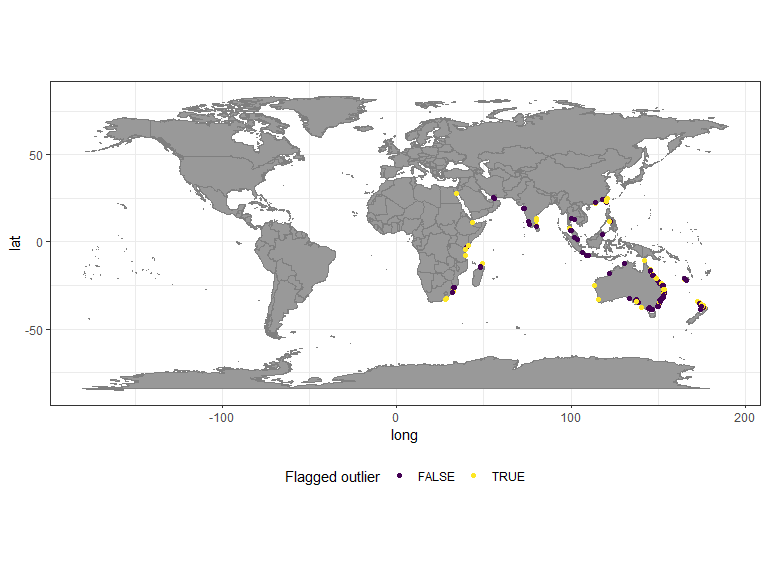
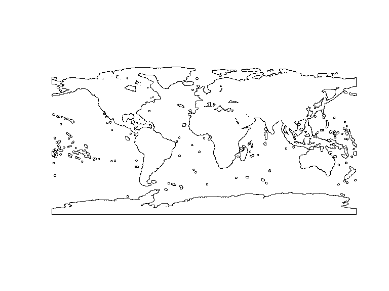
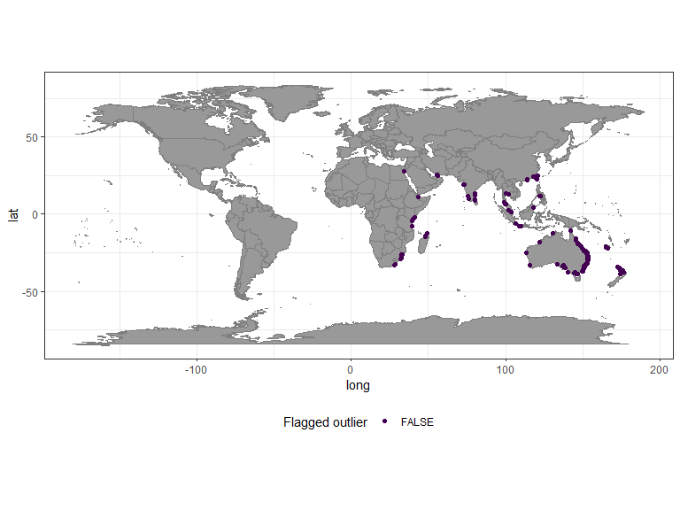

```{r options, echo = FALSE}
knitr::opts_chunk$set(eval = FALSE)
```

CoordinateCleaner identifies potentially erroneous geographic records with
coordinates assigned to the sea, countr coordinate, country capitals, urban
areas, institutions, the GBIF headquarters and countries based on the comparison
with geographic gazetteers (i.e. reference databases). All of these functions
include default reference databases compiled from various sources. These default
references have been selected suitable for regional to global analyses. They
will also work for smaller scale analyses, but in some case different references
might be desirable and available. this could be for instance centroids of small
scale political units, a different set of urban areas, or a different coastline
when working with coastal species. To account for this, each *CoordinateCleaner*
function using a gazetteer has a `ref` argument to specify custom gazetteers.

We will use the case of coastlines and a coastal species to demonstrate the
application of custom gazetteers. The purpose of `cc_sea` is to flag records in
the sea, since these often represent erroneous and undesired records for
terrestrial organisms. The standard gazetteer for this function is fetched from
naturalearthdata.com at a 1:50m scale. However, often coordinates available from
public databases are only precise at the scale of kilometres, which might lead
to an overly critical flagging of coordinates close to the coastline, which is a
problem especially for coastal or intertidal species. WE illustrate the issue on
for the mangrove tree genus *Avicennia*.


```{r}
library(CoordinateCleaner)
library(dplyr)
library(ggplot2)
library(rgbif)
library(viridis)
library(terra)

#download data from GBIF
dat <- rgbif::occ_search(scientificName = "Avicennia", limit = 1000,
         hasCoordinate = T)

dat <- dat$data

dat <-  dat %>% 
  dplyr::select(species = name, decimalLongitude = decimalLongitude, 
         decimalLatitude = decimalLatitude, countryCode)

# run with default gazetteer
outl <- cc_sea(dat, value = "flagged")
## OGR data source with driver: ESRI Shapefile 
## Source: "C:\Users\az64mycy\AppData\Local\Temp\Rtmp4SRhHV", layer: "ne_110m_land"
## with 127 features
## It has 3 fields

plo <- data.frame(dat, outlier =  as.factor(!outl))

#plot results
ggplot() +
  borders(fill = "grey60") +
  geom_point(data = plo, 
             aes(x = decimalLongitude, y = decimalLatitude, col = outlier)) +
  scale_color_viridis(discrete = T, name = "Flagged outlier") +
  coord_fixed() +
  theme_bw() +
  theme(legend.position = "bottom")
```



A large number of the coastal records gets flagged, which in this case is undesirable, because it is not a function of the records being wrong, but rather of the precision of the coordinates and the resolution of the reference. To avoid this problem you can use a buffered reference, which avoids flagging records close to the coast line and only flags records from the open ocean. *CoordinateCleaner* comes with a one degree buffered reference (`buffland`). In case a narrower or distance true buffer is necessary, you can provide any SpatVector similar in structure to `buffland` via the `ref` argument.


```{r}
# The buffered custom gazetteer
data("buffland")
buffland <- terra::vect(buffland)
plot(buffland)
```



```{r}

# run with custom gazetteer
outl <- cc_sea(dat, value = "flagged", ref = buffland)

plo <- data.frame(dat, outlier =  as.factor(!outl))

#plot results
ggplot()+
  borders(fill = "grey60")+
  geom_point(data = plo, 
             aes(x = decimalLongitude, y = decimalLatitude, col = outlier))+
  scale_color_viridis(discrete = T, name = "Flagged outlier")+
  coord_fixed()+
  theme_bw()+
  theme(legend.position = "bottom")
```



